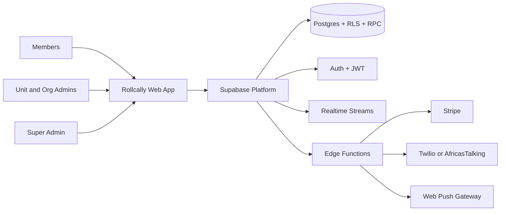
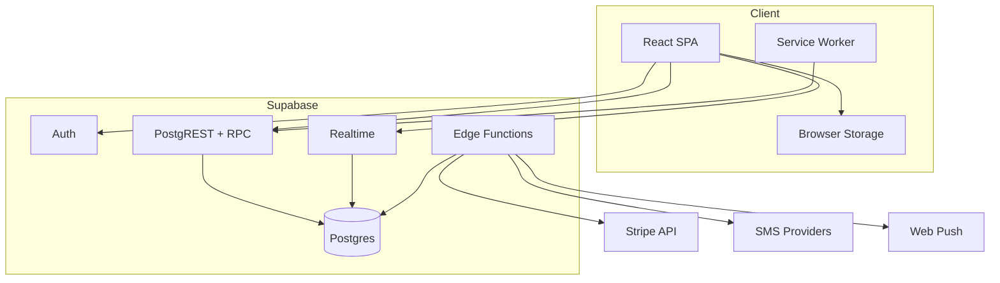
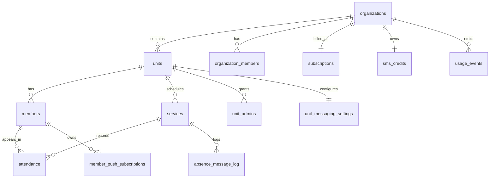
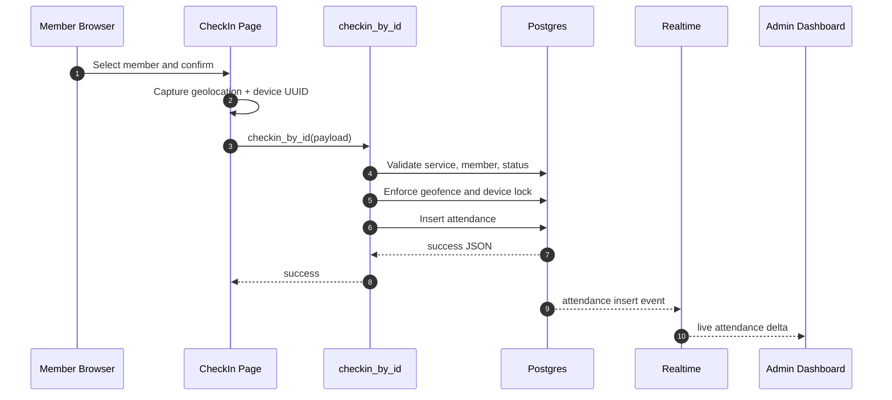
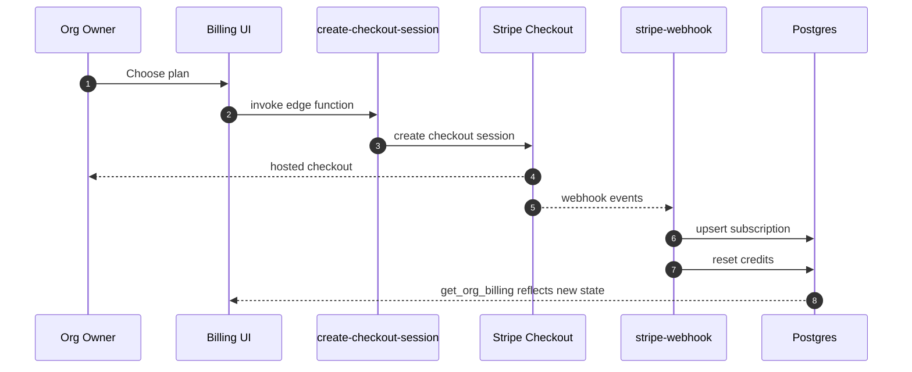
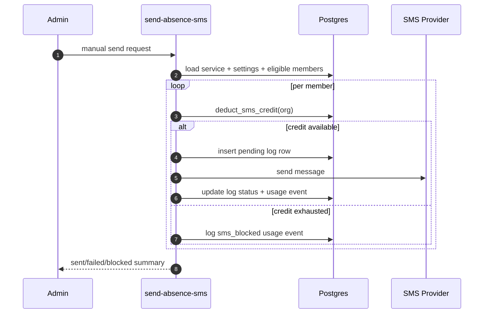

# Rollcally Enterprise Architecture Document

## 1. Document Purpose

This document defines:
- The as-built architecture currently implemented in the repository.
- The enterprise target state required for scale, governance, and compliance.
- A prioritized transition plan from current state to target state.

All as-built claims are evidence-based and tied to implementation sources.

## 2. Architectural Drivers

### 2.1 Business Drivers

- Fast event check-in for high-throughput group sessions.
- Multi-tenant operations across organizations and units.
- Follow-up automation with subscription monetization.

[Ref: public/llms.txt:7, src/pages/Billing.tsx:121, supabase/migrations/20260406_billing.sql:2]

### 2.2 Technical Drivers

- Mobile-first UX and installable PWA behavior.
- Strong tenant isolation and role-based permissions.
- Near real-time attendance state for admins.

[Ref: vite.config.ts:17, supabase/schema.sql:27, src/hooks/useAdminDashboard.ts:356]

### 2.3 Risk Drivers

- Public/anon check-in entrypoint must resist abuse.
- Billing correctness under concurrency.
- Messaging reliability and consent compliance.

[Ref: supabase/schema.sql:679, supabase/migrations/20260406_billing.sql:172, supabase/functions/send-absence-sms/index.ts:294]

## 3. System Context (C4 Level 1)

## 4. Container Architecture (C4 Level 2)

### 4.1 Container Responsibilities

| Container | Primary responsibility | Evidence |
| --- | --- | --- |
| React SPA | Routing, UI state, interaction flows | `src/App.tsx`, `src/pages/*` |
| Service worker | Caching strategy and push event handling | `src/sw.ts` |
| PostgREST + RPC | Data and function access boundary | `src/lib/supabase.ts`, `supabase/schema.sql` |
| Realtime | Attendance delta propagation | `src/hooks/useAdminDashboard.ts:356` |
| Edge Functions | Billing sync, messaging dispatch, push fan-out, user delete | `supabase/functions/*` |
| Postgres | Tenant data, RLS, triggers, authorization functions | `supabase/schema.sql`, `supabase/migrations/*` |

## 5. Logical Domain Architecture

### 5.1 Domain Boundaries

- Identity and access: auth session, super admin, org membership, unit admin assignment.
- Attendance: services, members, attendance check-in state.
- Engagement: push subscriptions, birthday notifications, absence messaging.
- Revenue and usage: pricing plans, subscriptions, credits, usage events.

[Ref: src/contexts/AuthContext.tsx:46, supabase/schema.sql:85, supabase/schema.sql:156, supabase/migrations/20260406_billing.sql:13]

### 5.2 Core Entity Relationship View

## 6. Critical Runtime Sequences

### 6.1 Sequence A: Secure Check-In

Evidence: `src/hooks/useAttendance.ts:56`, `supabase/schema.sql:562`, `src/hooks/useAdminDashboard.ts:356`.

### 6.2 Sequence B: Billing Activation

Evidence: `src/pages/Billing.tsx:202`, `supabase/functions/create-checkout-session/index.ts:129`, `supabase/functions/stripe-webhook/index.ts:91`.

### 6.3 Sequence C: Absence Messaging with Credit Guardrail

Evidence: `src/pages/AdminServiceDetail.tsx:458`, `supabase/functions/send-absence-sms/index.ts:342`, `supabase/migrations/20260406_billing.sql:172`.

## 7. Security Architecture

### 7.1 Control Matrix

| Control area | As-built implementation | Evidence | Maturity |
| --- | --- | --- | --- |
| AuthN | Supabase session and route protection wrappers | `src/contexts/AuthContext.tsx`, `src/components/ProtectedRoute.tsx` | Strong |
| AuthZ | RLS + security-definer helper functions and policies | `supabase/schema.sql:205`, `supabase/schema.sql:285` | Strong |
| Tenant isolation | Org/unit-scoped policy predicates | `supabase/schema.sql:352`, `supabase/schema.sql:390` | Strong |
| Privileged admin | Super admin table lookup (not metadata-only) | `src/contexts/AuthContext.tsx:68`, `supabase/migrations/20260326_secure_super_admin.sql:11` | Strong |
| Billing integrity | Atomic credit deduction with row lock | `supabase/migrations/20260406_billing.sql:172` | Strong |
| Consent governance | Explicit per-member sms_consent with service-scoped RPC verification for anon check-in flow | `supabase/migrations/20260402_sms_consent.sql:53`, `supabase/migrations/20260412_harden_anon_attendance_and_sms_consent.sql:18` | Moderate |
| External event trust | Stripe webhook signature verification | `supabase/functions/stripe-webhook/index.ts:69` | Strong |

### 7.2 Security Notes

- Anonymous check-in and consent APIs remain for member UX, but the boundary has been tightened: direct anon attendance table inserts were removed and consent writes are service-scoped.
- Super-admin destructive actions (org delete, user delete) exist and should eventually emit immutable audit records.

[Ref: supabase/schema.sql:557, supabase/migrations/20260412_harden_anon_attendance_and_sms_consent.sql:12, supabase/migrations/20260412_harden_anon_attendance_and_sms_consent.sql:18, src/pages/SuperAdminDashboard.tsx:167, supabase/functions/delete-user/index.ts:52]

## 8. Reliability and Performance Architecture

### 8.1 Current Reliability Mechanisms

- Client retries for transient RPC/network faults.
- SMS and push retries with exponential backoff and timeout limits.
- Idempotent webhook persistence via upserts.
- Realtime update stream for attendance freshness.

[Ref: src/lib/retry.ts:27, supabase/functions/send-absence-sms/index.ts:163, supabase/functions/send-push/index.ts:30, supabase/functions/stripe-webhook/index.ts:18, src/hooks/useAdminDashboard.ts:356]

### 8.2 Performance Characteristics

- Dashboard pagination defaults to 100 member rows per page.
- Public check-in search enforces minimum three-character query and debounce.
- Export flow hard-caps absent-member export at 5,000 records.

[Ref: src/hooks/useAdminDashboard.ts:300, src/hooks/useChoristers.ts:34, src/pages/AdminServiceDetail.tsx:797]

## 9. Deployment and Environment Architecture

### 9.1 As-Built Deployment Pattern

- Frontend built with Vite and deployed to Vercel in CI.
- Supabase hosts database, auth, realtime, and edge workloads.
- CI uses Node 24 and runs lint/typecheck/build before deploy.

[Ref: .github/workflows/ci.yml:19, .github/workflows/ci.yml:60, src/lib/supabase.ts:17]

### 9.2 Environment Inputs

- Frontend requires `VITE_SUPABASE_URL` and `VITE_SUPABASE_ANON_KEY`.
- Edge functions require service and third-party secrets (Stripe, SMS, VAPID).

[Ref: .env.example:4, supabase/functions/create-checkout-session/index.ts:43, supabase/functions/send-absence-sms/index.ts:45, supabase/functions/send-push/index.ts:76]

## 10. Data and Schema Governance

### 10.1 Current State

- `supabase/schema.sql` is marked as canonical bootstrap but explicitly states it includes migrations only through 20260315.
- Newer capabilities (messaging, billing, location improvements) are in later migrations.

[Ref: supabase/schema.sql:3, supabase/migrations/20260401_absence_messaging.sql:1, supabase/migrations/20260406_billing.sql:1, supabase/migrations/20260411_location_improvements.sql:1]

### 10.2 Governance Risk

- Running schema bootstrap alone on a fresh environment can omit critical post-20260315 features unless migrations are also applied.

## 11. Enterprise Gap Assessment

### 11.1 Gaps (As-Built vs Enterprise)

1. Release governance:
- E2E is informational and not release-blocking.

2. Migration governance:
- Canonical schema and migration timeline are split; stronger single-path bootstrapping is needed.

3. Auditability:
- No explicit immutable admin-action audit log table visible in repository.

4. SLO/alerting posture:
- Error capture exists (Sentry + logs), but no explicit SLO definitions or alert routing policies are codified.

Evidence: `.github/workflows/ci.yml:70`, `supabase/schema.sql:3`, `src/lib/logger.ts:23`, `src/main.tsx:8`.

### 11.2 Enterprise Target State

- Enforced migration pipeline with drift detection in CI.
- Production release gates including integration and critical E2E suites.
- Formalized observability stack with SLO, error budget, and on-call runbooks.
- Immutable governance audit trail for super-admin actions.
- Threat model and abuse detection for remaining anon RPC endpoints.

## 12. Recommended Architecture Evolution Plan

### Wave 1 (0-30 days)

- Add migration consistency checks in CI.
- Convert critical security and billing E2E tests to blocking gates.
- Add structured audit events for org/admin block/delete operations.

### Wave 2 (30-90 days)

- Define and instrument SLOs for check-in success latency and dashboard freshness.
- Add alert policies on edge-function failure classes (Stripe webhook errors, SMS blocked spikes, push send failures).
- Introduce periodic access-review workflow for super-admin and org-owner permissions.

### Wave 3 (90+ days)

- Formal compliance mapping (GDPR/CCPA controls to code and runbooks).
- Capacity test harness for event-start traffic spikes.
- Disaster recovery playbook validation exercises.

## 13. Decision Log (Current)

1. Use security-definer RPCs for anonymous check-in and service-scoped consent updates to preserve low-friction member UX while tightening write boundaries.
2. Use row-level locks for billing-credit correctness under concurrency.
3. Use append-only usage events for auditability and monetization analytics.
4. Keep edge integrations separated by concern (checkout, webhook, SMS, push, delete-user).

Evidence: `supabase/schema.sql:562`, `supabase/migrations/20260412_harden_anon_attendance_and_sms_consent.sql:12`, `supabase/migrations/20260412_harden_anon_attendance_and_sms_consent.sql:18`, `supabase/migrations/20260406_billing.sql:172`, `supabase/migrations/20260406_billing.sql:135`, `supabase/functions/*`.

## 14. Source References

Primary files used:
- `src/App.tsx`
- `src/contexts/AuthContext.tsx`
- `src/components/ProtectedRoute.tsx`
- `src/hooks/useAttendance.ts`
- `src/hooks/useChoristers.ts`
- `src/hooks/useAdminDashboard.ts`
- `src/pages/CheckIn.tsx`
- `src/pages/AdminServiceDetail.tsx`
- `src/pages/Billing.tsx`
- `src/pages/SuperAdminDashboard.tsx`
- `src/lib/retry.ts`
- `src/lib/logger.ts`
- `src/sw.ts`
- `vite.config.ts`
- `.github/workflows/ci.yml`
- `supabase/schema.sql`
- `supabase/migrations/20260401_absence_messaging.sql`
- `supabase/migrations/20260402_sms_consent.sql`
- `supabase/migrations/20260406_billing.sql`
- `supabase/migrations/20260411_location_improvements.sql`
- `supabase/migrations/20260412_harden_anon_attendance_and_sms_consent.sql`
- `supabase/functions/create-checkout-session/index.ts`
- `supabase/functions/stripe-webhook/index.ts`
- `supabase/functions/send-absence-sms/index.ts`
- `supabase/functions/send-push/index.ts`
- `supabase/functions/delete-user/index.ts`
