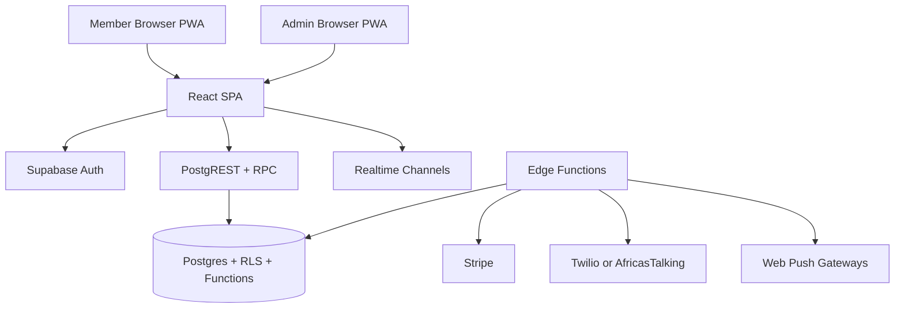
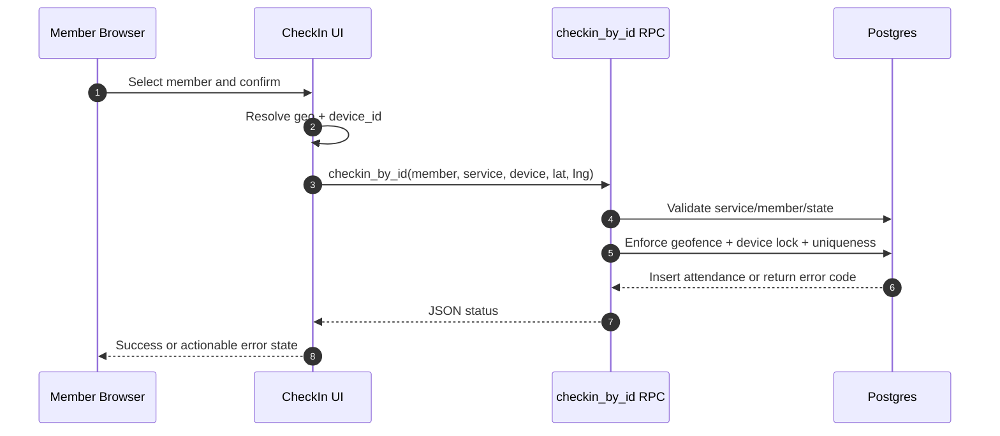

# Rollcally Whitepaper

## 1. Executive Summary

Rollcally is a multi-tenant attendance platform delivered as a Progressive Web App (PWA). It is designed for organizations that run recurring sessions and need fast, verifiable, low-friction check-in with live operational visibility.

The platform combines:
- QR and search-based member check-in flows.
- Geofenced attendance validation when required.
- Device-lock controls to reduce proxy check-in abuse.
- Real-time dashboard updates for administrators.
- Automated absence messaging with explicit consent controls.
- Subscription billing with credit-based usage governance.

The frontend is a React + Vite TypeScript SPA, while backend services rely on Supabase (Postgres, Auth, Realtime, Edge Functions) with security controls implemented through RLS and security-definer RPCs. [Ref: src/App.tsx:26, src/hooks/useAttendance.ts:36, supabase/schema.sql:562, supabase/functions/send-absence-sms/index.ts:234, supabase/migrations/20260406_billing.sql:58]

## 2. Product Problem and Value Proposition

### 2.1 Problem

Paper attendance and ad hoc spreadsheets produce:
- Slow check-in queues.
- No reliable anti-fraud controls.
- Delayed or missing attendance analytics.
- No automation for follow-up and re-engagement.

### 2.2 Rollcally Positioning

Rollcally provides a single operating surface for:
- Front-door check-in experience (`/checkin`).
- Unit and org admin operations (`/admin/...`).
- Super-admin platform governance (`/__rc_super`).

The route model is explicit and role-gated in code. [Ref: src/App.tsx:37, src/components/ProtectedRoute.tsx:20, src/components/ProtectedRoute.tsx:33]

## 3. Scope and Core Capabilities

### 3.1 Attendance Operations

- Service-based check-in tied to `service_id` query parameter.
- Search-based member lookup with minimum query length and debounce.
- Check-in status machine with outcomes for success and failure reasons.

[Ref: src/pages/CheckIn.tsx:24, src/hooks/useChoristers.ts:11, src/hooks/useAttendance.ts:6]

### 3.2 Presence Integrity Controls

- Optional location enforcement at service level (`require_location`).
- Effective venue resolution (service override first, then unit defaults).
- Device lock: one device cannot check in multiple members in one service.

[Ref: src/hooks/useChoristers.ts:81, supabase/schema.sql:593, supabase/schema.sql:659]

### 3.3 Admin Insights and Control

- Paginated member attendance view per service.
- Real-time attendance event stream (insert/delete).
- Absent-list exports in TXT, CSV, and RTF.

[Ref: src/hooks/useAdminDashboard.ts:324, src/hooks/useAdminDashboard.ts:356, src/pages/AdminServiceDetail.tsx:208]

### 3.4 Messaging and Notifications

- Web push subscription capture and Go Live dispatch.
- Automated absence SMS with per-unit settings and cooldown window.
- Consent-gated messaging pipeline.

[Ref: src/hooks/usePushNotifications.ts:20, supabase/functions/send-push/index.ts:66, supabase/functions/send-absence-sms/index.ts:294, supabase/migrations/20260402_sms_consent.sql:53]

### 3.5 Monetization

- Stripe subscription lifecycle sync via webhook.
- Plan-based monthly credits.
- Atomic deduction/refund/reset credit functions.

[Ref: src/pages/Billing.tsx:162, supabase/functions/stripe-webhook/index.ts:89, supabase/migrations/20260406_billing.sql:172]

## 4. Technology Stack

| Layer | Technology | Evidence |
| --- | --- | --- |
| Frontend runtime | React 18 + TypeScript | `package.json` dependencies [Ref: package.json:22] |
| Build/tooling | Vite 5 + plugin-react | [Ref: package.json:43, vite.config.ts:5] |
| Styling | Tailwind CSS | [Ref: package.json:55] |
| Routing | react-router-dom v6 | [Ref: package.json:34, src/App.tsx:1] |
| Error telemetry | Sentry browser SDK | [Ref: src/main.tsx:3, src/main.tsx:8] |
| Data/auth/realtime | Supabase JS + Postgres + Realtime | [Ref: src/lib/supabase.ts:1, src/hooks/useAdminDashboard.ts:356] |
| Edge compute | Supabase Edge Functions (Deno) | [Ref: supabase/functions/create-checkout-session/index.ts:40] |
| E2E test framework | Playwright | [Ref: package.json:13, playwright.config.ts:1] |

## 5. Architecture Overview

### 5.1 UI Composition

- Provider chain: `ToastProvider` and `AuthProvider` wrap all routes.
- Public, protected admin, and super-admin routes are separated.

[Ref: src/App.tsx:28, src/App.tsx:50, src/App.tsx:64]

### 5.2 Service Worker and Offline Strategy

- PWA uses `injectManifest` strategy with custom `sw.ts`.
- Caching covers app shell, fonts, and member-list RPC endpoint.
- Network-first strategy is used for `get_service_members` RPC.

[Ref: vite.config.ts:10, src/sw.ts:14, src/sw.ts:27]

## 6. Data Architecture and Tenancy

### 6.1 Tenant Model

- Tenant root: `organizations`.
- Hierarchy: `organizations -> units -> members/services -> attendance`.
- Admin associations: `organization_members` and `unit_admins`.

[Ref: supabase/schema.sql:19, supabase/schema.sql:56, supabase/schema.sql:85, supabase/schema.sql:99, supabase/schema.sql:141]

### 6.2 Key Domain Entities

- `services` defines event schedule and optional location requirements.
- `attendance` records event-member presence with device and geo metadata.
- `member_push_subscriptions` stores browser push endpoints.
- `unit_messaging_settings` and `absence_message_log` define SMS automation behavior.
- Billing entities: `pricing_plans`, `subscriptions`, `sms_credits`, `usage_events`.

[Ref: supabase/schema.sql:99, supabase/schema.sql:141, supabase/schema.sql:174, supabase/migrations/20260401_absence_messaging.sql:10, supabase/migrations/20260406_billing.sql:13]

### 6.3 Data Consistency Patterns

- Trigger-driven owner seeding for organizations and units.
- Join request approval trigger adds membership atomically.
- Unique attendance key (`service_id`, `member_id`) prevents duplicate check-ins.
- SMS log uses unique (`service_id`, `member_id`) row to prevent duplicate sends.

[Ref: supabase/schema.sql:491, supabase/schema.sql:452, supabase/schema.sql:507, supabase/schema.sql:150, supabase/migrations/20260401_absence_messaging.sql:56]

## 7. Security and Access Control

### 7.1 Authentication and Route Access

- User authentication handled by Supabase Auth session.
- `AdminRoute` enforces session + blocked checks.
- `SuperRoute` enforces super-admin-only access.

[Ref: src/contexts/AuthContext.tsx:133, src/components/ProtectedRoute.tsx:26, src/components/ProtectedRoute.tsx:37]

### 7.2 Authorization in Data Layer

- RLS enabled on major operational tables.
- Policy checks rely on security-definer helper functions (`is_org_owner`, `is_unit_admin`, etc.).
- Public check-in executes through tightly scoped RPCs rather than broad table write access.

[Ref: supabase/schema.sql:27, supabase/schema.sql:205, supabase/schema.sql:247, supabase/schema.sql:529, supabase/schema.sql:562]

### 7.3 High-Risk Flow Controls

- Super-admin authority based on DB table, not metadata claim.
- Stripe webhook validates signature before processing events.
- SMS send path refuses send when subscription is inactive or credits exhausted.

[Ref: src/contexts/AuthContext.tsx:68, supabase/functions/stripe-webhook/index.ts:69, supabase/functions/send-absence-sms/index.ts:271, supabase/functions/send-absence-sms/index.ts:356]

### 7.4 Consent and Privacy Safeguards

- Member SMS consent tracked at `members.sms_consent`.
- Consent RPC available to anon/authenticated contexts for check-in UX.
- Absence send eligibility requires consent + phone + absence status.

[Ref: supabase/migrations/20260402_sms_consent.sql:53, supabase/migrations/20260402_sms_consent.sql:110, supabase/functions/send-absence-sms/index.ts:294]

## 8. Runtime Flow Summaries

### 8.1 Member Check-In Sequence

[Ref: src/hooks/useAttendance.ts:56, src/hooks/useAttendance.ts:77, supabase/schema.sql:612, supabase/schema.sql:648, supabase/schema.sql:671]

### 8.2 Admin Real-Time Dashboard

- Dashboard page loads paginated roster via `get_service_members_full`.
- Realtime channel listens to `attendance` inserts/deletes.
- UI recalculates present/absent slices in-memory.

[Ref: src/hooks/useAdminDashboard.ts:324, src/hooks/useAdminDashboard.ts:356, src/hooks/useAdminDashboard.ts:388]

### 8.3 Absence Messaging

- Manual trigger from admin UI or scheduled cron invocation.
- Pipeline checks settings, date/time window, subscription state, consent, cooldown.
- Each send attempts credit deduction first; blocked sends are logged for audit.

[Ref: src/pages/AdminServiceDetail.tsx:458, supabase/functions/send-absence-sms/index.ts:567, supabase/functions/send-absence-sms/index.ts:595, supabase/functions/send-absence-sms/index.ts:342]

## 9. Billing and Monetization Model

### 9.1 Billing Data Model

- Plans are seeded in `pricing_plans`.
- One subscription record per organization.
- Credits tracked in `sms_credits`.
- Feature usage tracked append-only in `usage_events`.

[Ref: supabase/migrations/20260406_billing.sql:13, supabase/migrations/20260406_billing.sql:58, supabase/migrations/20260406_billing.sql:104, supabase/migrations/20260406_billing.sql:135]

### 9.2 Stripe Lifecycle Integration

- Checkout session creation validates org ownership.
- Active subscribers are redirected to Stripe portal for management.
- Webhook sync handles checkout completion, invoice paid, subscription updates/deletes.

[Ref: supabase/functions/create-checkout-session/index.ts:73, supabase/functions/create-checkout-session/index.ts:105, supabase/functions/stripe-webhook/index.ts:91]

### 9.3 Credit Governance

- `deduct_sms_credit` uses row lock (`FOR UPDATE`) to avoid race conditions.
- `refund_sms_credit` handles duplicate/concurrency correction path.
- `reset_sms_credits` refreshes allowance per cycle.

[Ref: supabase/migrations/20260406_billing.sql:172, supabase/migrations/20260406_billing.sql:212, supabase/migrations/20260406_billing.sql:231]

## 10. Quality Engineering and Validation

### 10.1 Automated Test Coverage

- 21 end-to-end test suites under `tests/e2e`.
- 4 integration suites against real Supabase.
- Coverage includes auth, security hardening, location checks, billing, messaging, and super-admin controls.

[Ref: tests/e2e/security.spec.ts:25, tests/e2e/billing.spec.ts:221, tests/e2e/location-toggle.spec.ts:148, tests/integration/sms.spec.ts:108]

### 10.2 CI/CD Quality Gates

- Build job runs lint, typecheck, and production build.
- Deployment job depends on build success.
- E2E runs as informational (`continue-on-error: true`) and does not block deploy.

[Ref: .github/workflows/ci.yml:10, .github/workflows/ci.yml:37, .github/workflows/ci.yml:66]

## 11. Reliability and Operational Controls

### 11.1 Resilience Patterns in Code

- Client retry with exponential backoff for transient failures.
- SMS and push delivery retries with timeout boundaries.
- Graceful fallback behavior in edge handlers.

[Ref: src/lib/retry.ts:27, supabase/functions/send-absence-sms/index.ts:159, supabase/functions/send-push/index.ts:24]

### 11.2 Observability

- Frontend error reporting initialized through Sentry.
- Structured logging wrapper used for info/warn/error context.
- Edge functions emit structured console logs for operational traces.

[Ref: src/main.tsx:8, src/lib/logger.ts:23, supabase/functions/send-push/index.ts:74]

## 12. Current Constraints and Known Gaps

The following gaps are directly observable in repository behavior and should be considered in enterprise planning:

1. Canonical schema drift risk:
- `supabase/schema.sql` states it incorporates migrations only through `20260315`, while production-critical features are in later migration files.
- This can create bootstrap inconsistency if operators rely on schema.sql alone.

[Ref: supabase/schema.sql:3, supabase/migrations/20260406_billing.sql:1, supabase/migrations/20260411_location_improvements.sql:1]

2. Non-blocking E2E in CI:
- End-to-end test job does not gate release.

[Ref: .github/workflows/ci.yml:70]

3. Public RPC surface:
- Anonymous execution for check-in and consent RPCs is intentional for UX, but should be continuously threat-modeled and monitored.

[Ref: supabase/schema.sql:557, supabase/schema.sql:679, supabase/migrations/20260402_sms_consent.sql:127]

## 13. Enterprise Readiness Roadmap

### Phase 1: Governance and Control Hardening

- Establish single bootstrap path that applies all migrations in order.
- Make E2E and integration quality gates release-blocking for production branches.
- Add explicit migration lint/check process in CI.

### Phase 2: Security and Compliance Maturity

- Add formal threat model around anon RPC boundary and edge-function authz paths.
- Introduce auditable key rotation cadence for Stripe/SMS/VAPID secrets.
- Expand immutable audit logging for admin governance actions (org block/delete and admin delete).

### Phase 3: Operability and Scale

- Define SLOs for check-in success latency and dashboard freshness.
- Add centralized log aggregation and alerting for edge-function failure classes.
- Add load and concurrency tests for peak event start windows.

## 14. Source Index

Primary implementation evidence used in this whitepaper:
- `src/App.tsx`
- `src/contexts/AuthContext.tsx`
- `src/components/ProtectedRoute.tsx`
- `src/hooks/useAttendance.ts`
- `src/hooks/useChoristers.ts`
- `src/hooks/useAdminDashboard.ts`
- `src/pages/CheckIn.tsx`
- `src/pages/AdminServiceDetail.tsx`
- `src/pages/Billing.tsx`
- `src/lib/retry.ts`
- `src/lib/logger.ts`
- `src/sw.ts`
- `vite.config.ts`
- `supabase/schema.sql`
- `supabase/migrations/20260401_absence_messaging.sql`
- `supabase/migrations/20260402_sms_consent.sql`
- `supabase/migrations/20260406_billing.sql`
- `supabase/migrations/20260411_location_improvements.sql`
- `supabase/functions/create-checkout-session/index.ts`
- `supabase/functions/stripe-webhook/index.ts`
- `supabase/functions/send-absence-sms/index.ts`
- `supabase/functions/send-push/index.ts`
- `.github/workflows/ci.yml`
- `playwright.config.ts`
- `playwright.integration.config.ts`
